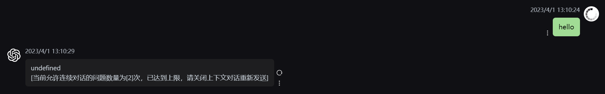
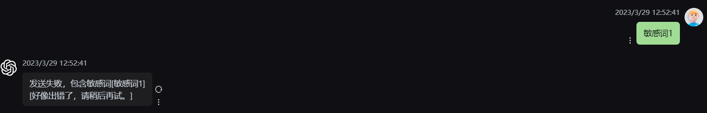
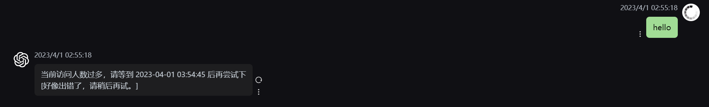
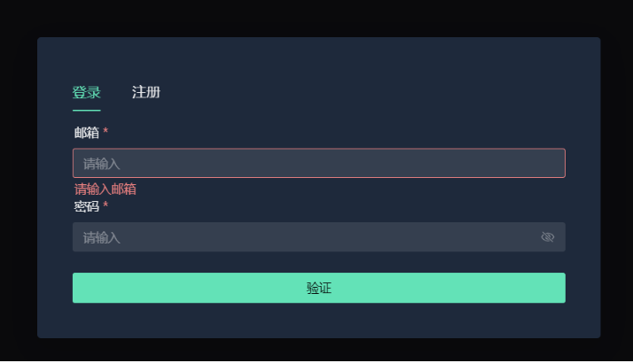
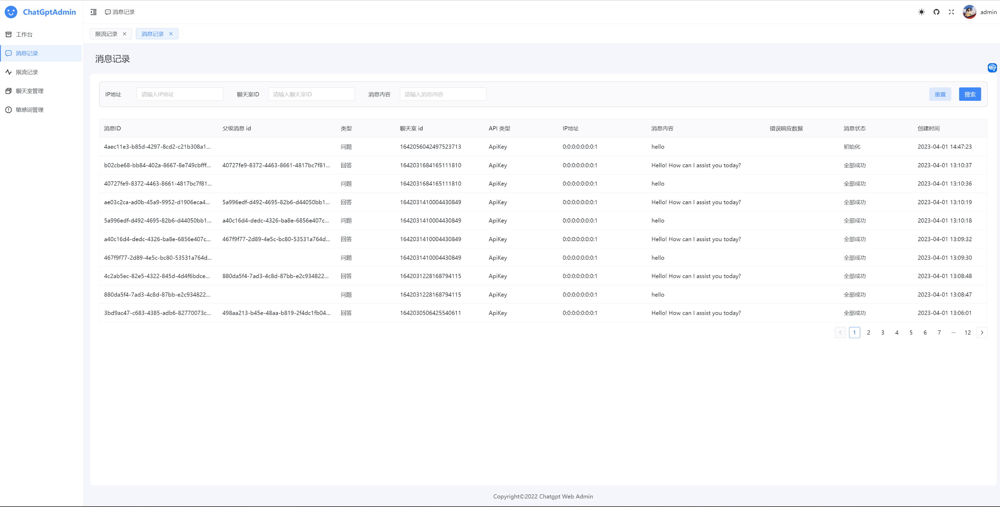
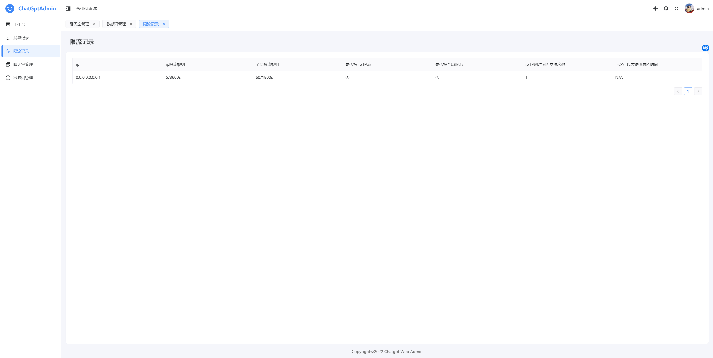
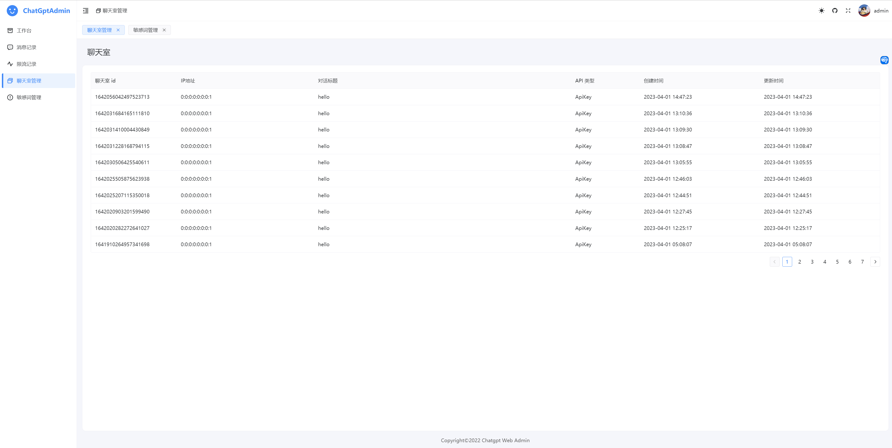
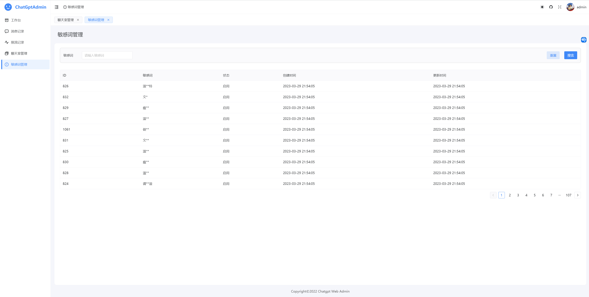
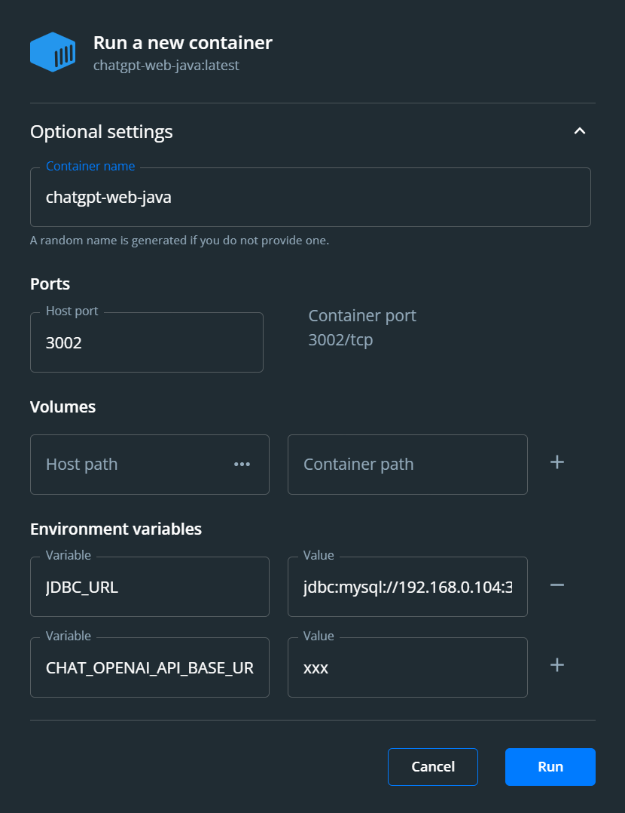

# chatgpt-web-java

# 介绍

- ChatGPT 说文解字前端的 Java 后台
- 前端-说文用户端开源代码 https://github.com/mjjh1717/chatgpt-shuowen
- 前端-解字管理端开源代码 https://github.com/hncboy/chatgpt-jiezi
- 2.0 升级版开发中，会接入 openai embeddings、Midjourney 等等

# 注意

### 关于提问

有问题优先通过文档和 issue 解决，也许你遇到的问题已经有解决方案了，没有的话可以提新的 issue。
### 关于 ApiKey

当前网站免费提问，因 ApiKey 额度有限，限流频率会比较高，如果有大佬赞助供网站使用的话十分感激。

# 框架

- Spring Boot 3.0.5
- JDK 17
- MySQL 8.x
- SpringDoc 接口文档
- MyBatis Plus
- MapStruct
- Lombok
- [Hutool](https://hutool.cn/) 
- [SaToken](https://sa-token.cc/) 权限校验
- [Grt1228 ChatGPT java sdk](https://github.com/Grt1228/chatgpt-java)
- ......

# 地址

- 接口文档：http://localhost:3002/swagger-ui.html
- 用户端：
  - https://front.stargpt.top/ (失效)
  - https://front1.stargpt.top/ (失效)
  - https://front2.stargpt.top/
  - https://front3.stargpt.top/

# 功能

## 已实现

### 上下文聊天

通过 MySQL 实现聊天数据存储来实现 apiKey 方式的上下文聊天，AccessToken 默认支持上下文聊天。可以通过配置参数 limitQuestionContextCount 来限制上下问问题的数量。

数据库存储了每次聊天对话的记录，在选择上下文聊天时，通过 parentMessageId 往上递归遍历获取历史消息，将历史问题以及回答消息都发送给 GPT。



### 敏感词过滤

在发送消息调用方法判断是否属于敏感词，是的话消息发送不成功。为了兼容前端保持上下文关系，在消息内容属于敏感词的情况下会正常返回消息格式，但是带的是请求的的 conversationId 和 parentMessagId，敏感词需要自己导入数据库。



### 限流

分为全局限流和 ip 限流，基于内存和双端队列实现滑动窗口限流。在限流过程会异步的将数据写入的文件中，在项目重启时会读取该文件恢复限流状态。

在配置文件中配置 maxRequest、maxRequestSecond、ipMaxRequest、ipMaxRequestSecond



### 登录注册

通过邮箱进行登录注册



## 待实现

- 目前聊天长度受上下文限制，后期调整为动态的控制上下文。

# 管理端

## 消息记录

展示消息的列表，问题和回答各是一条消息。通过父消息 id 关联上一条消息。父消息和当前消息一定是同一个聊天室的。



## 限流记录

查看各个 ip 的限流记录，只记录在限流时间范围的限流次数。



## 聊天室管理

查看聊天室。这里的聊天室和客户端左边的对话不是同一个概念。在同一个窗口中，我们既可以选择关联上下文发送后者不关联上下文发送。如果不关联上下文发送每次发送消息都会产生一个聊天室。



## 敏感词管理

查看敏感词列表，目前只提供了查询的功能，后期可以增加管理。



# 运行部署

## IDEA 运行

前端代码使用 WebStom、Vs Code 或者 pnpm install & dev 运行，后端 IDEA 运行。

## Docker

需要 clone 仓库并在根目录下执行

### MySQL

通过 Dockerfile_mysql  构建带有数据库表结构的镜像并运行，本地有 MySQL 可以跳过

```shell
  # 删除旧版 container （如果有的话）
  docker stop mysql_gpt && docker rm mysql_gpt
  # 构建 image
  docker build -t mysql_gpt_img:latest . -f Dockerfile_mysql
  # 运行 container
  docker run -d -p 3309:3306 \
       --name mysql_gpt \
       -v ~/mydata/mysql_dummy/data:/var/lib/mysql \
       -v  ~/mydata/mysql_dummy/conf:/etc/mysql/conf.d \
       -v ~/mydata/mysql_dummy/log:/var/log/mysql \
       mysql_gpt_img:latest
```

### Java

通过 Docker 构建 Java 应用镜像并运行

```shell
  # 删除旧版 container （如果有的话）
  docker stop chatgpt-web-java && docker rm chatgpt-web-java
  docker build -t chatgpt-web-java .
  docker run -d -p 3002:3002 chatgpt-web-java
```
如果要显式指定参数，可以在 `docker run` 后添加 `-e` 选项，配置 `application.yml` 用到的参数。例如：

```shell
  # 删除旧版 container （如果有的话）
  docker stop chatgpt-web-java && docker rm chatgpt-web-java
  docker build -t chatgpt-web-java . 
  # 如果这里要使用 java 的容器访问 mysql 容器，需要使用 host.docker.internal 而不是 localhost，才可以访问到宿主机的 3009 端口（mysql开放了3009端口）
  docker run -d -p 3002:3002 \
      -e JDBC_URL=jdbc:mysql://host.docker.internal:3309/chat?useUnicode=true&characterEncoding=UTF-8&autoReconnect=true&serverTimezone=Asia/Shanghai \
      -e MYSQL_USER_NAME=root \
      -e MYSQL_PASSWORD=123456 \
      -e CHAT_OPENAI_API_KEY=xxx \
      -e CHAT_OPENAI_ACCESS_TOKEN=xxx \
      -e CHAT_OPENAI_API_BASE_URL=http://xxx.com \
      -e CHAT_HTTP_PROXY_HOST=127.0.0.1 \
      -e CHAT_HTTP_PROXY_PORT=7890 \
      chatgpt-web-java
```
  

## docker-compose

在 `docker-compose.yml` 文件中配置好配置后，使用 `docker-compose up -d` 可一键启动。

# 数据库表

表结构路径：`chatgpt-bootstrap/src/main/resources/db`。 不需要额外数据库的可以自行连接  H2 地址，改下连接方式就可以。


- chat_message 聊天室表
- chat_room 聊天记录表
- email_verify_code 邮件验证码表
- front_user_base 前端基础用户表
- front_user_extra_binding 前端基础用户扩展绑定表
- front_user_extra_email 前端基础用户邮箱扩展
- sensitive_word 敏感词表
- sys_email_send_log 邮件发送日志表
- sys_front_user_login_log 前端用户登录日志表
